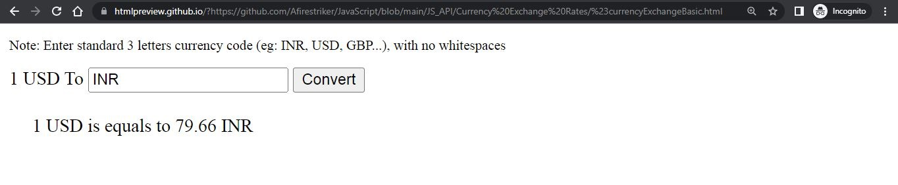

## Run the application by visiting the following link:

> <a target="_blank" href="https://htmlpreview.github.io/?https://github.com/Afirestriker/JavaScript/blob/main/JS_API/Currency%20Exchange%20Rates/%23currencyExchangeBasic.html"> Basic Currency Rates Exchange Application </a>
  

> <a target="_blank" href="https://htmlpreview.github.io/?https://github.com/Afirestriker/JavaScript/blob/main/JS_API/Currency%20Exchange%20Rates/currencyExchange.html"> Advance Currency Rates Exchange Application </a>
  

